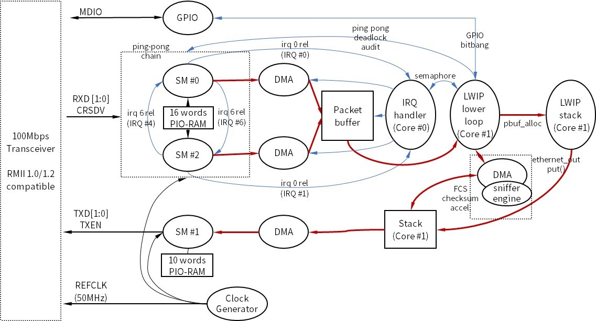

# pico-rmii-ethernet (for real usage)

***Enable 100Mbit/s Ethernet connectivity for real environment with your [Raspberry Pi Pico]*** using DMA and PIO capability of RP2040 with an external RMII-based Ethernet PHY module.

[Raspberry Pi Pico]: (https://www.raspberrypi.org/products/raspberry-pi-pico/)

* iperf/TCP performance : ***50Mbps*** Rx (~ 4500 packets/sec, RP2040 = iperf TCP server)
    * Redesign the receiver side PIO-SM to handle fragmented frame / maximize performance
    * Implement hardware CRC engine (sniffer engine on RP2040)
* RMII v1.0 and ***v1.2 compatible***
    * Complement RX side SM to meet the RMII v1.2 CRS/DV characteristics
    * Tested with LAN8720 and KSZ8081 transceiver
* Tested in sdk v1.5 & v1.4


At first, started to test the throughput lightly, was disappointed with the result, found some issues with the original code, tried to improve, and finally share my code.

---
## <U>Issues in original repository</U>

### RMII receiver side SM code does not meet CRS/DV pattern of RMII v1.2
* Many Ethernet transceiver adopt RMII V1.2
    * CRS/DV output will  be toggled at end of frame if RMII v1.2 is adopted (red circle at image)
    * Refer [AN-1405 from TI] for more technical details
        

* It's not clear whether LAN8720 use RMII v1.2 or not
    * Packets are lost frequently when running `ping RP2040_IP -s 1450 -i 0.1`
    * Packets are not lost when running `ping RP2040_IP -s 1000 -i 0.1`

* And original code does not operates with KSZ8081 (clearly mentions RMII v1.2)

* So ***Using CRS/DV as an interrupt source to determine the end-of-frame*** in the original repo is inadequate.

[AN-1405 from TI]: https://www.ti.com/lit/an/snla076a/snla076a.pdf?ts=1672269799540&ref_url=https%253A%252F%252Fwww.google.com%252F

### Need optimization calculating ethernet frame FCS
* The original repo implements ***bit-based CRC32 calculation*** for FCS.
* Byte-based or using a sniffer engine in RP2040 should be considered to enhance performance.

### Handling fragmented packet
* I checked that the second frame is discarded when a packet is fragmented with two frames (tested with `ping RP2040_IP -s 2000`).

* This may cause a problem if you are planning to use CoAP or other DTLS-based secure transport.
    * DTLS hello packet carrying 2~3 certificates will be fragmented with two seperate frames.
* And it also affects TCP performance because TCP sends multiple packets with very short intervals while window control.

* I tried several code optimization but has failed. Because...
    * IPG (Inter Packet Gap) for 100Mbps = 960 nano-second.
    * 960nsec is too short to overcome with a single SM/DMA combination running at RP2040/100MHz

---

## <U>Implementation</U>

### Use Sniffer engine for FCS calculation
* With thanks to an example in SDK v1.5

### Redesign RMII receiver side code
* Use `irq` PIO assembly as notification for end-of-frame instead of CRS/DV signal.
* Use one more SM/DMA at the receiver side to receive the second frame while processing the first at ISR routine.
### Overall diagram implemented for RMII at RP2040



---

## <U>Throughput test result</U>
### Environment
* Test server : Ubuntu 22.0.4 LTS / VirtualBox
* Server side ethernet : ASIX AX88179 10/100Mbps USB/Ethenet dongle + USB 2.0 Hub + USB 3.0 Port (Windows PC)
* USB Controller setting at Virtualbox : USB 3.0
    * Speed of USB : 10Mbps (USB 1.0), 480Mbps (USB 2.0), 4.8Gbps (USB 3.0)

-------------------------------------------------------


## <U>Test result after implementation</U>
### Environment
* Test server : Ubuntu 22.0.4 LTS / VirtualBox
* Server side ethernet : ASIX AX88179 10/100Mbps USB/Ethenet dongle + USB 2.0 Hub + USB 3.0 Port (Windows PC)
* USB Controller setting at Virtualbox : USB 3.0
    * Speed per USB version : 10Mbps (USB 1.0), 480Mbps (USB 2.0), 4.8Gbps (USB 3.0)
* Run `iperf -c RP2040_IP` from linux server
    * LWIP : enable TCP_SACK
    * To enable TCP_SACK : Change below `#define` in `lib/lwip/src/include/lwip/opt.h`
        ```c
        /**
         * LWIP_TCP_SACK_OUT==1: TCP will support sending selective acknowledgements (SACKs).
        */
        #if !defined LWIP_TCP_SACK_OUT || defined __DOXYGEN__
        #define LWIP_TCP_SACK_OUT               1 // <== here
        #endif
        ```
### Result

| Case                          | Throughput | Note                          |
| ------------------------------|------------|-------------------------------|
| A. Sniffer FCS + double SM    | 50Mbps     | TCP_WND = 4, TCP_SACK=1       |
| B. Sniffer FCS + double SM    | 35Mbps     | TCP_WND = 4, TCP_SACK=0       |
| C. Sniffer FCS + single SM    | 17.8Mbps   | TCP_WND = 4, TCP_SACK=1       |
| D. Byte-based FCS + single SM | 2.23Mbps   | TCP_WND = 4, TCP_SACK=1       |
| E. Byte-based FCS + single SM | 21.7Mbps   | TCP_WND = 2, TCP_SACK=1       |

* Fragmented frames can not be handled in case C/D/E.
* Poor performance of case D
    * iperf/TCP sends packets at very short intervals until TCP_WND is full
    * More than half of the frames are discarded silently at the receiver side SM without notice in `TCP_WND=4` condition when I checked with wireshark after turn on TCP_SACK option in LwIP TCP stack

    * To modify TCP_WND : Change below `#define` in `lib/lwip/src/include/lwip/opt.h`
        ```c
        /**
         * TCP_WND: The size of a TCP window.  This must be at least
        * (2 * TCP_MSS) for things to work well.
        ...
        */
        #if !defined TCP_WND || defined __DOXYGEN__
        #define TCP_WND                         (4 * TCP_MSS) // <== here
        #endif
        ```

## <U>Compile</U>
1. Move to top directory after fork or clone this repository
1. Run `git submodule update --init --recursive` to update `lib/lwip` repository source
1. Create `build` directory and move to it
1. Run `cmake ..`

    > Change `pico_lwip` to `lwip_pico_n` in CMakeLists.txt if you meet `add_library cannot create target 'pico_lwip' ...` error while running `cmake ..`

1. Change RETCLK gpio setting `from 23 to 21` if you are using official RP2040 board

    ```c
    int main() {
    struct netif_rmii_ethernet_config netif_config = {
        pio0, // PIO:            0
        ...
        23,   // rmii clock:     21, 23, 24 or 25 => RETCLK <== here
        NULL,
    };
    // I'm using RP2040 compatible board which provides gpio 23 to header connector
    // So, gpio #23 is assigned to RETCLK pin in my repo.

    ```

1. Run `make` (at `build` directory)
1. Copy uf2 file to your RP2040
    * use `examples/iperf/pico_rmii_ethernet_iperf.uf2` for iperf test
    * use `examples/httpd/pico_rmii_ethernet_httpd.uf2` for http server test

## <U>Hardware</U>

* [YD-RP2040] or [RP2040] (YD-RP2040 is not pin-compatible with official RP2040)
* Any RMII based Ethernet PHY module, such as the [Waveshare LAN8720 ETH Board](https://www.waveshare.com/lan8720-eth-board.htm)

* Use ***as short a cable as possible*** between the RP2040 and the PHY module (the cable carry signal at 50MHz rate).

[RP2040]: https://www.raspberrypi.org/products/raspberry-pi-pico/
[YD-RP2040]: https://ko.aliexpress.com/item/1005004004120604.html

### Modification to do at PHY module


We're generating the 50MHz RMII clock on the RP2040 instead of getting it from the LAN8720A crystal. For that, we remove the two R12 and R14 resistors, and ***connect one of them (33ohm resistor) back on the two top pads*** instead to avoid connecting the onboard crystal to the clock, and instead connect the nINT/RETCLK pin from the connector to the XTAL1/CLKIN pin of the LAN8720A chip.

### Wiring

| RMII Module | Raspberry Pi Pico | Repository Code Default |
| ----------- | ----------------- | --------------- |
| TX1 | TX0 + 1 | 11 |
| TX-EN | TX0 + 2 | 12 |
| TX0 | any GPIO | 10 |
| RX0 | any GPIO | 6 |
| RX1 | RX0 + 1 | 7 |
| nINT / RETCLK | 21/23/24/25 | 23 (Change to 21 if official RP2040) |
| CRS | RX0 + 2 | 8 |
| MDIO | any GPIO | 14 |
| MDC | MDIO + 1 | 15 |
| VCC | 3V3 | |
| GND | GND | |

## <U>Examples</U>

See [examples](examples/httpd) folder for simple http server
See [iperf](examples/iperf) folder using default iperf TCP server code of LwIP for performance test

# Current Limitations
* 10BASE-T is not implemented yet.
* Built-in LWIP stack is compiled with `NO_SYS` so LWIP Netcon and Socket API's are not enabled
