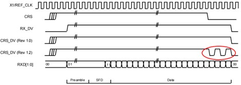

# pico-rmii-ethernet

***Enable 100Mbit/s Ethernet connectivity for real environment*** on your [Raspberry Pi Pico] using DMA and PIO capability of RP2040 with an RMII-based Ethernet PHY module.

[Raspberry Pi Pico]: (https://www.raspberrypi.org/products/raspberry-pi-pico/)

* ***iperf/TCP performance : 21.7Mbps Rx (RP2040 = iperf TCP server, unidirectional traffic)***
* ***ICMP performance : 11Mbps Rx + 11Mbps Tx (RP2040 = ICMP echo server, bidirectional traffic)***
* Complement RX pio SM to meet the RMII v1.2 CRS/DV characteristics
* Redesign the receive-side code for performance
* Implement hardware CRC engine called sniffer engine on RP2040
* Tested in sdk v1.5 & v1.4


## <U>Issues in original repository</U>
#### RMII RX side SM implementation in original repo is incomplete to meet CRS/DV pattern of RMII V1.2
* Most Ethernet PHY adopt RMII V1.2
    * CRS/DV output can be toggled at end of frame if RMII v1.2 is adopted (red circle at image)
    * CRS/DV toggling occur more frequently with larger frames or higher frame rates.
    * Refer [AN-1405 from TI] for more technical details
        

* LAN8720 also seems to adopt RMII v1.2 even though it does not mention it in their document
    * Packets are lost frequently when running `ping RP2040_IP -s 1450 -i 0.1`
    * Packets are not lost when running `ping RP2040_IP -s 1000 -i 0.1`
    * I can also see TCP retransmissions happening in the original http server example as well

* So ***Using CRS/DV as an interrupt source to determine the end-of-frame*** in the original repo is inadequate, even though the original version gives us inspiration for how to use RMII at RP2040

[AN-1405 from TI]: https://www.ti.com/lit/an/snla076a/snla076a.pdf?ts=1672269799540&ref_url=https%253A%252F%252Fwww.google.com%252F

## <U>Test result after implementation</U>
#### Test environment
* Test server : Ubuntu 22.0.4 LTS / VirtualBox
* Server side ethernet : ASIX AX88179 10/100Mbps USB/Ethenet dongle + USB 2.0 Hub + USB 3.0 Port (Windows PC)
* USB Controller setting at Virtualbox : USB 3.0
    * Speed per USB version : 10Mbps (USB 1.0), 480Mbps (USB 2.0), 4.8Gbps (USB 3.0)

#### Unidirectional bandwidth/performance test with iperf/TCP
* Run `iperf -c RP2040_IP` from linux server (test duration : 10sec)
* Test Condition : enable TCP_SACK, adjust TCP_WND (see below)
* Test result are as follows:

    | TCP_WND | Transfer (MBytes) | Bandiwdth (Mbps) | Comment |
    | ------- | -------- | --------- | ------- |
    | (4 * TCP_MSS) | 3.00  | 2.23 | Default setting of LwIP |
    | (3 * TCP_MSS) | 24.8  | 20.3 |  |
    | (2 * TCP_MSS) | 26.0  | 21.7 | Minimum value for TCP |

* performance degradation in higher TCP_WND
    * iperf/TCP sends packets at very short intervals until TCP_WND is full (at least in upper test cases)
    * And, Minimum IPG (Inter-Packet-Gap) for 100Mbps is 960nsec
    * And, there is no way to control DMA directly at pio SM
    * ***"960nsec or packet interval at TCP/kernel" is too short*** to cover with single DMA buffer in ISR callback running at RP2040/100MHz

    * Therefore, more than half of the frames are discarded silently at the receiver side SM without notice in `(4 * TCP_MSS)` condition (You can see what happens with wireshark after turn on TCP_SACK option in LwIP TCP stack)

* TCP_WND modification : Change below `#define` in `lib/lwip/src/include/lwip/opt.h`
    ```c
    /**
     * TCP_WND: The size of a TCP window.  This must be at least
     * (2 * TCP_MSS) for things to work well.
     ...
    */
    #if !defined TCP_WND || defined __DOXYGEN__
    #define TCP_WND                         (2 * TCP_MSS) // <== here
    #endif
    ```

* enable TCP_SACK : Change below `#define` in `lib/lwip/src/include/lwip/opt.h`
    ```c
    /**
     * LWIP_TCP_SACK_OUT==1: TCP will support sending selective acknowledgements (SACKs).
    */
    #if !defined LWIP_TCP_SACK_OUT || defined __DOXYGEN__
    #define LWIP_TCP_SACK_OUT               1 // <== here
    #endif
    ```


#### Bidirectional bandwidth/performance test with flood ping
* Run `ping RP2040_IP -f -s 1460` from linux server
* Test result are as follows:
    ```
    --- RP2040_IP ping statistics ---
    100000 packets transmitted, 100000 received, 0% packet loss, time 132205ms
    rtt min/avg/max/mdev = 1.109/1.239/18.602/0.265 ms, pipe 2, ipg/ewma 1.322/1.256 ms
    ```
* Simple profiling of rmii_ethernet.c (turn on USE_TIMELAPSE, turn-off USE_RMII_SM_STAT)

    | Type                         | Total | CRC calculation | LwIP | other code |
    | ---------------------------- | ----- | --------------- | ---- | ---------- |
    | netif_rmii_ethernet_output   | 312us | 283us, 91% | can't measure | 29us, 9% |
    | netif_rmii_ethernet_poll     | 736us | 283us, 38% | 469us, 64% | -16us, 0% |
    | Total (TX + RX)              | 1048us | 566us, 54% | 469us, 45% | 13us, 1% |


#### Stress test with flood ping with preload option
* Run `ping RP2040_IP -f -l 5 -s 1480` from linux server
* Test result are as follows:
    * While packets are injected, `s_sm_stat.rx_full` is incremented, but no other errors.
    ```
    --- RP2040_IP ping statistics ---
    14620 packets transmitted, 13599 received, 6.98358% packet loss, time 8972ms
    rtt min/avg/max/mdev = 1.146/2.988/8.355/0.653 ms, pipe 5, ipg/ewma 0.613/3.192 ms
    ```

## <U>Compile</U>
1. Move to top directory after fork or clone this repository
1. Run `git submodule update --init --recursive` to update `lib/lwip` repository source
1. Create `build` directory and move to it
1. Run `cmake ..`

    > Change `pico_lwip` to `lwip_pico_n` in CMakeLists.txt if you meet `add_library cannot create target 'pico_lwip' ...` error while running `cmake ..`

1. Change RETCLK gpio setting `from 23 to 21` if you are using official RP2040 board

    ```c
    int main() {
    struct netif_rmii_ethernet_config netif_config = {
        pio0, // PIO:            0
        ...
        23,   // rmii clock:     21, 23, 24 or 25 => RETCLK <== here
        NULL,
    };
    // I'm using RP2040 compatible board which provides gpio 23 to header connector
    // So, gpio #23 is assigned to RETCLK pin in my repo.

    ```

1. Run `make` (at `build` directory)
1. Copy uf2 file to your RP2040
    * use `examples/iperf/pico_rmii_ethernet_iperf.uf2` for iperf test
    * use `examples/httpd/pico_rmii_ethernet_httpd.uf2` for http server test

## <U>Hardware</U>

* [YD-RP2040] or [RP2040] (YD-RP2040 is not pin-compatible with official RP2040)
* Any RMII based Ethernet PHY module, such as the [Waveshare LAN8720 ETH Board](https://www.waveshare.com/lan8720-eth-board.htm)

* Use ***as short a cable as possible*** between the RP2040 and the PHY module (the cable carry signal at 50MHz rate).

[RP2040]: https://www.raspberrypi.org/products/raspberry-pi-pico/
[YD-RP2040]: https://ko.aliexpress.com/item/1005004004120604.html

### Modification to do at PHY module


We're generating the 50MHz RMII clock on the RP2040 instead of getting it from the LAN8720A crystal. For that, we remove the two R12 and R14 resistors, and ***connect one of them (33ohm resistor) back on the two top pads*** instead to avoid connecting the onboard crystal to the clock, and instead connect the nINT/RETCLK pin from the connector to the XTAL1/CLKIN pin of the LAN8720A chip.

### Wiring

| RMII Module | Raspberry Pi Pico | Repository Code Default |
| ----------- | ----------------- | --------------- |
| TX1 | TX0 + 1 | 11 |
| TX-EN | TX0 + 2 | 12 |
| TX0 | any GPIO | 10 |
| RX0 | any GPIO | 6 |
| RX1 | RX0 + 1 | 7 |
| nINT / RETCLK | 21/23/24/25 | 23 (Change to 21 if official RP2040) |
| CRS | RX0 + 2 | 8 |
| MDIO | any GPIO | 14 |
| MDC | MDIO + 1 | 15 |
| VCC | 3V3 | |
| GND | GND | |

## <U>Examples</U>

See [examples](examples/httpd) folder for simple http server
See [iperf](examples/iperf) folder using default iperf TCP server code of LwIP for performance test

# Release history
* After v0.1
    * Fix MDIO bug doing bit-bang
    * Change FCS from software to hardware (calculation time: 230us -> 20us when `ping -s 1460`)

# Current Limitations

* `Framented packets` or `short interval packes` are not be handled properly.
    * because of performance limitation of `single SM + interrupt driven DMA control`
    * in the case of TCP, this does not cause a problem (see `test result`for how-to-do)
    * but this cause problem if you need to use DTLS having many certificates.

* 10BASE-T is not implemented yet.
* Built-in LWIP stack is compiled with `NO_SYS` so LWIP Netcon and Socket API's are not enabled

